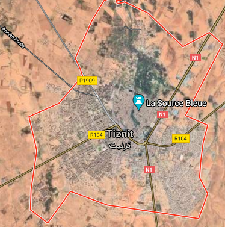
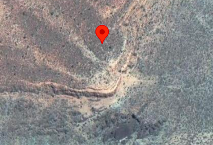

# python-api-challenge

  

### contains:
weatherpy folder:
* weatherpy.ipynb
* outputs folder:
    - cities.csv (a csv of 553 randomly chosen cities throughout the world)
    - .pngs of graphs of several variables vs. latitude:
        * cloudLatAllCities.png (cloudiness v. latitude for all 553 cities)
        * humLatAllCities.png (humidity v. latitude for all 553  cities)
        * northern_latitude_v_cloudiness.png (cloudiness v. latitude for cities in the northern hemisphere)
        * northern_latitude_v_max_temperature(F).png (maximum   temperature (F) v. latitude in the northern hemisphere)
        * northern_latitude_v_percent_humidity.png (percent humidity v. latitude in the northern hemisphere)
        * northern_latitude_v_wind_speed.png (wind speed v. latitude in the northern hemisphere)
        * southern_latitude_v_cloudiness.png (cloudiness v. latitude for cities in the southern hemisphere)
        * southern_latitude_v_max_temperature(F).png (maximum   temperature (F) v. latitude in the southern hemisphere)
        * southern_latitude_v_percent_humidity.png (percent humidity v. latitude in the southern hemisphere)
        * southern_latitude_v_wind_speed.png (wind speed v. latitude in the southern hemisphere)
        * tempLatAllCities.png (maximum temperature (F) v. latitude for all 553 cities)
        * windLatAllCities.png (wind speed v. latitude for all 553 cities)
    
vacationpy folder:
* vacationpy.ipynb
* images folder:
    - heatmapsymbols.png (an image of the heatmap and symbol levels on the 8 ideal temperature cities)

### description:
#### weatherpy:

  

The weatherpy.ipynb file used citipy and the open weather map api to construct a dataframe of 553 randomly chosen cities, along with their latitudes and longitudes, and several climate variables (maximum temperature, cloudiness, wind speed, and humidity) measured on 24 December 2020. Those climate variables were graphed against each city's latitude to draw out any potential relationships. The outputs folder holds images of the resulting graphs, and a csv of all the data on the cities.

The following steps were taken within the weatherpy.ipynb:
* Generating the 500+ cities:
    * creating a range of latitude and longitude values for numpy.random to work on (so that non-existent latitudes/longitudes, such as 200 degrees longitude, don't get generated).
    * using numpy.random to create two lists of 1500 numbers each within the defined ranges, to create latitude/longitude pairs.
        - the lists are 1500 numbers long to account for repeats and for latitude and longitude pairs that don't successfully create cities.
    * using citipy.nearest_city to find unique cities near the randomly created latitude/longitude pairs, and appending to a list (cities).
        - the cities list is 603 cities long, down from 1500 lat/long pairs
* Obtaining climate data for the 500+ cities:
    * creating a for loop to call the open weather map api and append climate variables to lists
        - a try/except was built in, skipping cities for which data couldn't be found in the open weather api
        - checking the length of these lists shows they are 553 cities long: this is how many cities analysis will be done on
* Creating a data frame and data cleaning:
    * creating a dataframe out of the lists for analysis (weather_data_df)
    * checking to see if any humidity values need to dropped due to them exceeding 100%
    * reading the data frame to a csv (saving to the outputs folder)
    * reading the csv back in to the notebook as weather_df
        - exporting and importing the csv was done in order to create a stable data source over several working periods. If not done, every time the notebook is returned to, the data would change, due to the open weather api being called again.
* Creating scatter plots for all the data, saving them to the outputs folder:
    * temperature v. latitude
    * humidity v. latitude
    * cloudiness v. latitude
    * wind speed v. latitude
* Creating separate dataframes for the northern and southern hemispheres:
    * creating a mask for latitude > 0 or < 0 and applying it to weather_df
    * saving the results of those masks as northern_hemi_data_df and southern_hemi_data_df
* Creating scatter plots and linear regressions for the northern and southern hemisphere climate variables:
    * defining a function (scatter_linreg()) to create a scatter plot based on different variables, a linear regression based on those variables, and saving those graphs to the outputs folder.
    * calling the function for the following variable pairs, for both the northern and southern hemisphere:
        * temperature v. latitude
        * humidity v. latitude
        * cloudiness v. latitude
        * wind speed v. latitude
        - after each pair of graphs, observations are made as to what the graphs may suggest
#### vacationpy:

The vacationpy.ipynb file used the cities.csv generated in weatherpy.ipynb, and gmaps, to draw a heatmap of the humidity of the 553 randomly generated cities. The csv and gmaps were further used to discover cities fitting certain criteria making them fit for a holiday. Using the google apis nearby search, hotels near those cities were found. The coordinates of the cities with ideal weather were found more accurately using google apis place search, and hotels near those coordinates were found using nearby search. Using those hotels, a symbol layer was added to the heatmap listing information about those hotels. The images folder contains a screenshot of the final heatmap with a symbol layer of the locations of those hotels.

The following steps were taken within the vacationpy.ipynb:
* Importing the data
    * reading in the cities.csv
        - reminder: the latitude/longitudes in this csv stem from open weather maps responses
    * creating a dataframe (cities_for_heatmap_df)
* Creating a heatmap
    * checking the maximum humidity value to know what to set the maximum intensity to on the heatmap
    * creating a weighted heatmap with gmaps.heatmap_layer
        - setting the weights of the heatmap to be the humidity of each city
        - setting the maximum intensity(= maximum humidity), point radius (size of each point on the map, set to 2), and dissipation (whether the heat will dissipate upon zoom, set to False) to ensure the heat will be visible on different zoom levels
        - setting the opacity as 0.5 so the brightness is not overwhelming
* Creating a dataframe of cities with 'ideal' weather:
    * filtering cities_for_heatmap_df using a mask with the following criteria:
        - maximum temperature is between 60 and 70 F
        - wind speed is less than 10 mph
        - cloudiness is 0%
    * creating a new dataframe containing those cities (ideal_weather_df)
    * creating a new empty column in ideal_weather_df to hold hotel names
* Creating a copy of ideal_weather_df using df.copy() (true_ideal_weather_df)
* Finding hotels within 5 km of each city in ideal_weather_df
    * creating a for loop to request nearby search from google apis for each city in ideal_weather_df
        - a try/except was included for if a hotel could not be found (IndexError)
    * testing to see whether the index error occurred due to hotels being further than 5 km from the city
        - hotels were found for each of the cites within 20 km
* Creating a dataframe for the 'ideal' weather cities using google maps place search
    * calling google maps place search using place names in true_ideal_weather_df to find city coordinates
    * replacing the lat, lng columns in true_ideal_weather_df with those new coordinates
* Finding hotels within 5 km of each city in true_ideal_weather_df
    * creating a for loop to request nearby search from google apis for each city in true_ideal_weather_df
* Creating a symbol layer on top of a heatmap
    * using iterrows to create an info box for each hotel in true_ideal_weather_df
    * recreating the heatmap weighted by humidities of all cities in cities_for_heatmap_df
    * using gmaps.marker_layer to apply the info boxes on top of the heatmap

After completing vacationpy.ipynb, a screenshot was taken of the final heatmap/symbol layer and saved to the images folder.

### final considerations
This analysis contained several challenges/interesting issues. Within weatherpy, even though random numbers were generated for the latitude/longitude pairs, the final 553 cities dataframe still ended up containing more cities in the northern hemisphere. This persisted even after running the code several times. Perhaps this could be due to either citipy or open weather maps not being able to find data on as many cities in the southern hemisphere. The documentation on citipy states that only cities with over 500 inhabitants are counted; with areas with low population density such as the Amazon rainforest and central Australia in the southern hemisphere, and very high density places such as the coastal United States, western Europe, India and China in the northern hemisphere, perhaps citipy has more nearby cities for the northern hemisphere (Center for International Earth Science Information Network, 2018). Additionally, perhaps open weather maps has fewer city monitoring stations in the southern hemisphere, causing more southern hemisphere cities to be skipped when obtaining weather data for them. Whichever way the disparity occurred, it follows the analysis all the way to the end of the weatherpy notebook, potentially causing differences in the correlation coefficients in each hemisphere data graph. 

Weatherpy also shows the limits of linear regression, in that it can only show the relationship between two variables, and a linear relationship at that. As discussed within the notebook, factors that were not measured, such as seasonal variation, distance from water, altitude, and other factors that were measured, such as longitude, could all play a role in variables like cloudiness or humidity, but cannot be plotted within a linear regression. Dividing the graphs further, such as making graphs for each longitude, or weighting the scatterplot for variables such as altitude, could be ways of taking more variables into account, but that still ignores other sorts of relationships that do not fall into the y = mx + b formula, such as exponential growth or waves. Linear regression appeared most successful for the relationship between temperature and latitude, while cloudiness, humidity, and wind speed all seem to have other factors influencing them besides latitude. 

Additionally, to make claims about correlations between different variables, more than one day of measurement should be taken. The day of measurement, 24 December 2020, could have been a day of extreme variables that are not representative, as well as only representing one season per hemisphere. While the one strong linear regression correlation found between temperature and latitude appears commonsense, it cannot be asserted without further repetition of the data set. 

In vacationpy, one city, Tiznit (Morocco), did not initially turn up data until the search radius was widened to 20 km. However, if one looks up Tiznit on google maps using its name, several hotels return as being within 5 km (Google, 2021a). The issue appears to be the coordinates that open weather maps assigns to the city name 'Tiznit'. If the open weather maps coordinates for Tiznit are entered into google maps, it returns an unpopulated area within Tiznit province, but not within the city of Tiznit itself (Google, 2021b). While the geographic coordinates returned by open weather maps may be a useful spot for determining weather, it is not an ideal spot to assign to the city of Tiznit. 

  
  

<em>Comparison of Tiznit, searched by name; and Tiznit, searched by OWM-assigned coordinates.</em>
<nl><nl>
This highlights the issue of using apis for purposes different from their stated ones: open weather maps is not primarily meant for locating cities, but is instead for determining weather, so it may be permissible to use a looser definition of a place's coordinates if it provides clearer weather data. Perhaps pulling weather data from within the city of Tiznit itself caused too much interference, or perhaps a pre-existing ground weather station already existed outside of Tiznit, so that was what was used. While this approximation of Tiznit was fine for the weatherpy portion of this project, the vacationpy section requires more precise coordinates for each city, in order to accurately return hotels within the required distance. 

In order to remove this imprecision, google maps place search should be called first, to find accurate city coordinates, before calling google maps nearby search to find hotels. It is an extra step, and as shown by only 1 of 9 cities not turning up hotels when using open weather maps coordinates, one might not think it would cause many issues with results. However, the results would certainly be more accurate if using google place search coordinates, and thus more helpful. If one compares the coordinates obtained for the cities using open weather maps and google place search, the differences are not large: usually a couple hundredths of a degree, except for Tiznit, where the difference in latitude is about 0.1 degrees, and in longitude is ~0.2 degrees; but those increments matter enough to find a hotel in Tiznit, and to change the hotel that comes up for Shadegan and Turbat.

**References**

Center for International Earth Science Information Network - CIESIN - Columbia University (2018). _Gridded Population of the World, Version 4(GPWv4): Population Density, Revision 11._ Palisades, NY: NASA Socioeconomic Data and Applications Center (SEDAC). Retrieved January 3, 2021 from https://sedac.ciesin.columbia.edu/data/set/gpw-v4-population-density-rev11/maps. 

Google. (2021a). [Google Map of Tiznit, Morocco]. Retrieved January 3, 2021 from https://www.google.com/maps/place/Tiznit+85000,+Morocco/@29.7010448,-9.7654605,11623m/data=!3m2!1e3!4b1!4m5!3m4!1s0xdb479f80a0432e5:0x4de7b30202dab839!8m2!3d29.693392!4d-9.732157

Google. (2021b). [Google Map of coordinates 29.58, -9.5]. Retrieved January 3, 2021 from <https://www.google.com/maps/place/29°34'48.0"N+9°30'00.0"W/@29.58,-9.5019969,727m/data=!3m2!1e3!4b1!4m5!3m4!1s0x0:0x0!8m2!3d29.58!4d-9.5>